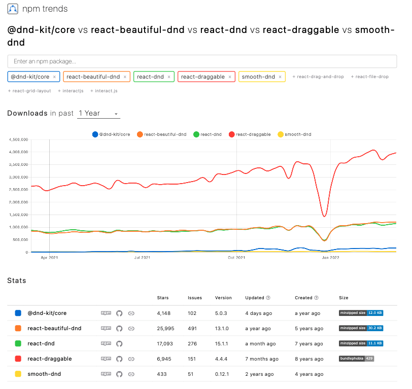

# Compare React Drag And Drop Lib

## npm trends

<https://www.npmtrends.com/@dnd-kit/core-vs-react-beautiful-dnd-vs-react-dnd-vs-react-draggable-vs-smooth-dnd>

## Library候補

*   react-draggable

    *   [npm](https://www.npmjs.com/package/react-draggable)

    *   [demo](https://mzabriskie.github.io/react-draggable/example/)

*   react-beautiful-dnd

    *   [npm](https://www.npmjs.com/package/react-beautiful-dnd)

    *   [demo](https://react-beautiful-dnd.netlify.app/iframe.html?id=board--simple)

*   react-dnd

    *   [npm](https://www.npmjs.com/package/react-dnd)

    *   [demo](https://react-dnd.github.io/react-dnd/examples/sortable/simple)

*   @dnd-kit/core

    *   [npm](https://www.npmjs.com/package/@dnd-kit/core)

    *   [demo](https://5fc05e08a4a65d0021ae0bf2-cqqwtsynom.chromatic.com/?path=/story/presets-sortable-vertical--basic-setup)

*   smooth-dnd

    *   [npm](https://www.npmjs.com/package/smooth-dnd)

    *   [demo](https://kutlugsahin.github.io/smooth-dnd-demo/)

## 相談内容

- どこまで調査・共有資料つくるのか
  - 共有資料として、上記の内容で必要十分か
  - 各ライブラリを簡易的なComponentを実装し、ソースコードベースで使いやすさの検討