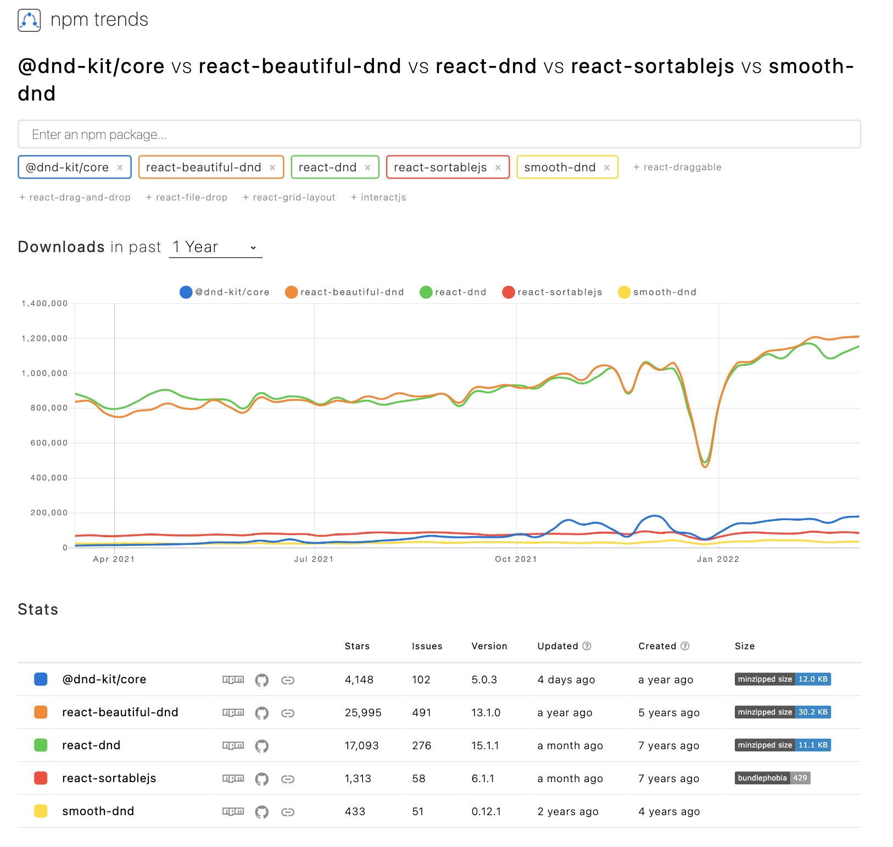

# Compare React Drag And Drop Lib

## npm trends

<https://www.npmtrends.com/@dnd-kit/core-vs-react-beautiful-dnd-vs-react-dnd-vs-react-draggable-vs-smooth-dnd>

## Library候補

*   react-sortablejs ... [npm](https://www.npmjs.com/package/react-sortablejs) / [demo](https://sortablejs.github.io/Sortable/) / [options](https://github.com/SortableJS/Sortable#options)

*   react-beautiful-dnd ... [npm](https://www.npmjs.com/package/react-beautiful-dnd) / [demo](]https://react-beautiful-dnd.netlify.app/iframe.html?id=board--simple)

*   react-dnd ... [npm](https://www.npmjs.com/package/react-dnd) / [demo](https://react-dnd.github.io/react-dnd/examples/sortable/simple)

*   @dnd-kit/core ... [npm](https://www.npmjs.com/package/@dnd-kit/core) / [demo](https://5fc05e08a4a65d0021ae0bf2-cqqwtsynom.chromatic.com/?path=/story/presets-sortable-vertical--basic-setup)

*   smooth-dnd ... [npm](https://www.npmjs.com/package/smooth-dnd) / [demo](https://kutlugsahin.github.io/smooth-dnd-demo/)

## 比較表

| Lib.                | Git Stars  | Downloads (2022/03/10 \~ 16)　 | 最終更新            | メリット             | デメリット                      |
| :------------------ | :--------- | :---------------------------- | :-------------- | :--------------- | :------------------------- |
| react-sortablejs    | 1.4 K      | 89 K                          | [8 Feb 2022]()  | - 実装簡単           | - UXは少しカスタムが必要             |
| react-beautiful-dnd | [26.5 K]() | [1255 K]()                    | 22 Mar 2021     | - UXが綺麗そう - メジャー | - 実装が少し複雑                  |
| react-dnd           | 17.3 K     | [1179 K]()                    | [8 Feb 2022]()  | - メジャー           | - 実装が複雑 - サードパーティライブラリへの依存 |
| @dnd-kit/core       | 4.2 K      | 192 K                         | [14 Mar 2022]() | - 実装簡単           |                            |
| react-smooth-dnd    | 1.6 K      | 17 K                          | ?? ?? 2020      |                  |                            |

## 結論

| Lib.                | 使い易さ/実装のし易さ | UXの良さ | メジャー度/npm評価 | その他メモ                                                         |
| :------------------ | :---------: | :---: | :---------: | :------------------------------------------------------------ |
| react-sortablejs    |      ○      |   △   |      △      | - UXをよくするために、pluginの調整が必要 - 双方向データバインディングであるため、間に処理を挟む等は調整が必要 |
| react-beautiful-dnd |      ○      |   ○   |      ○      |                                                               |
| react-dnd           |      ×      |   ○   |      ○      | - サードパーティライブライを参照                                             |
| @dnd-kit/core       |      ○      |   ○   |      △      |                                                               |
| react-smooth-dnd    |      ○      |   ○   |      △      |                                                               |

## Memo

*   ジェネリック型のコンポーネントで実装できたら尚理想
